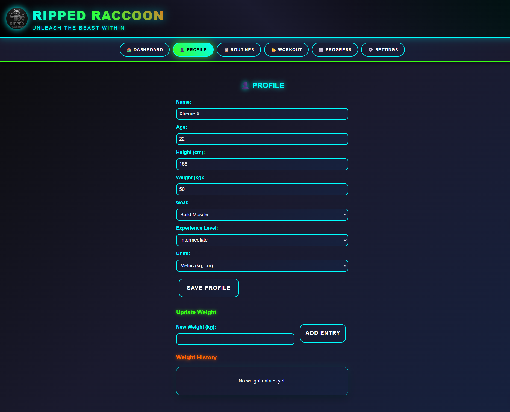

# 🦝 RippedRaccoon - Fitness Tracking App

<div align="center">
  
  
  **UNLEASH THE BEAST WITHIN**
  
  A modern, full-stack fitness tracking application with a cyberpunk-inspired neon theme.
  
  [](https://reactjs.org/)
  [](https://www.typescriptlang.org/)
  [](https://nodejs.org/)
  [](https://www.sqlite.org/)
</div>

## App Screenshots
Homepage Dashboard

Profile Page

Set a Routine

Check Progress

Start a workout session


## ✨ Features

### 🏠 **Dashboard**
- Real-time workout statistics and KPIs
- Current & longest workout streaks
- Weekly workout frequency tracking
- Quick action buttons for immediate workout start

### 👤 **Profile Management**
- Complete user profile with fitness goals
- Body weight tracking with history
- Metric/Imperial unit preferences
- Progress visualization

### 📋 **Workout Routines**
- Pre-built professional workout routines
- Custom routine creation with exercise selection
- Muscle group categorization
- Sets and reps customization

### 💪 **Live Workout Sessions**
- Interactive workout logging
- Rest timer with customizable intervals
- Real-time set completion tracking
- Exercise progression monitoring
- Workout pause/resume functionality

### 📈 **Progress Tracking**
- Exercise-specific progress charts
- Body weight trend analysis
- Workout frequency analytics
- Volume and strength progression

### ⚙️ **Settings & Data Management**
- Workout preferences configuration
- Complete data export/import
- Workout history reset functionality
- Local storage integration

## 🎨 Design Features

- **Cyberpunk Neon Theme** - Dark background with electric blue, green, and orange accents
- **Responsive Design** - Works seamlessly on desktop and mobile devices
- **Smooth Animations** - Glowing effects, hover transitions, and pulse animations
- **Intuitive UX** - Clean navigation with emoji icons and clear visual hierarchy

## 🏗️ Architecture

```
RippedRaccoon_P1/
├── client/                 # React TypeScript Frontend
│   ├── src/
│   │   ├── components/     # React components with individual CSS
│   │   ├── images/         # App assets and icons
│   │   └── App.tsx         # Main application component
│   └── package.json
├── server/                 # Node.js Express Backend
│   ├── database/          # SQLite schema and seed data
│   ├── index.js           # Express server with REST API
│   └── package.json
└── package.json           # Root scripts for development
```

## 🚀 Quick Start

### Prerequisites
- Node.js 18.x or higher
- npm or yarn package manager

### Installation

1. **Clone the repository**
   ```bash
   git clone https://github.com/yourusername/rippedraccoon.git
   cd RippedRaccoon_P1
   ```

2. **Install all dependencies**
   ```bash
   npm run install-all
   ```

3. **Start development servers**
   ```bash
   npm run dev
   ```

4. **Access the application**
   - Frontend: http://localhost:3000
   - Backend API: http://localhost:5000

### Individual Development
```bash
# Frontend only (React dev server)
npm run client

# Backend only (Express server)
npm run server
```

## 🔌 API Endpoints

### Core Endpoints
- `GET /api/health` - Server health check
- `GET /api/exercises` - Get all exercises
- `GET /api/routines` - Get workout routines
- `POST /api/routines` - Create custom routine

### User Management
- `GET /api/users/:id` - Get user profile
- `PUT /api/users/:id` - Update user profile
- `POST /api/weight-logs` - Log body weight
- `GET /api/weight-logs/:userId` - Get weight history

### Workout Tracking
- `POST /api/workouts` - Start workout session
- `PUT /api/workouts/:id` - Update workout
- `POST /api/workout-logs` - Log exercise sets
- `GET /api/summary/:userId` - Get dashboard KPIs

### Progress & Analytics
- `GET /api/progress/exercise/:exerciseId` - Exercise progress
- `GET /api/progress/bodyweight/:userId` - Weight trends
- `GET /api/progress/workouts/:userId` - Workout frequency

### Data Management
- `GET /api/export/:userId` - Export user data
- `POST /api/import/:userId` - Import user data
- `DELETE /api/reset/:userId` - Reset all workout records

## 🛠️ Technology Stack

### Frontend
- **React 18** with TypeScript
- **CSS3** with custom neon theme
- **Recharts** for data visualization
- **Responsive design** with CSS Grid/Flexbox

### Backend
- **Node.js** with Express.js
- **SQLite** database with file persistence
- **CORS** enabled for cross-origin requests
- **RESTful API** architecture

### Development Tools
- **Concurrent** for running multiple processes
- **Component-based CSS** architecture
- **TypeScript** for type safety
- **Modern ES6+** JavaScript features

## 📱 Deployment

### Free Hosting Options

**Frontend (Vercel - Recommended)**
```bash
npm install -g vercel
cd client && npm run build
vercel --prod
```

**Backend (Railway - Recommended)**
```bash
npm install -g @railway/cli
cd server
railway login && railway init && railway up
```

**Alternative Options:**
- Frontend: Netlify, GitHub Pages
- Backend: Render, Heroku

## 🤝 Contributing

1. Fork the repository
2. Create a feature branch (`git checkout -b feature/amazing-feature`)
3. Commit your changes (`git commit -m 'Add amazing feature'`)
4. Push to the branch (`git push origin feature/amazing-feature`)
5. Open a Pull Request

## 📄 License

This project is licensed under the MIT License - see the [LICENSE](LICENSE) file for details.

## 👨‍💻 Author

**Abhyuday** - *Full Stack Developer*

---

<div align="center">
  <strong>🦝 RIPPED RACCOON - UNLEASH THE BEAST WITHIN 🦝</strong>
  
  Made with ❤️ and lots of ☕
</div>
